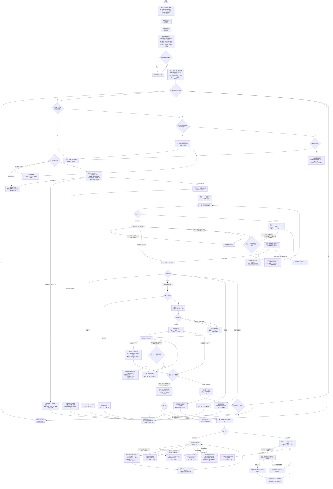

# 短信号码购买与 GoPay 账号处理流程

> 本流程适用于 SMSBower 和 HeroSMS：服务/国家/价格查询、号码购买、请求下一条短信、结算和取消均按任务所属平台执行。收码方式按平台分开：SMSBower 保留 `getStatus` 轮询；HeroSMS 的登录码、改 PIN 码和后续码全部由 webhook 驱动，不调用 HeroSMS `getStatus`。两个平台的 API Key 分开加密保存，官方接口地址内置，页面不需要 Base URL。
>
> “计划购买数量”是最终需要达到的 `fulfilled` 成功数，不是累计购号上限。号码在进入 `fulfilled` 前遇到未注册、PIN 登录要求、0 RP、验证码超时、处理失败、过期或手动删除等终态结果时，会释放处理槽位并自动补购，因此 `purchased` 可超过计划数量；`fulfilled` 达标后任务进入 `completed`。已 `fulfilled` 号码在后续收码阶段被取消、过期或删除时，保留成功计数且不触发补购。购号或落库回执未知时会冻结自动购买，避免重复扣费。
>
> 号码不再使用历史黑名单或指纹去重：不维护 `phone_history`，也不会因历史购买记录将新号码标记为 `duplicate`。仅对当前仍有未结束激活的同一号码做并发使用保护：新分配会标记为 `phone_in_use`，自动取消并释放槽位；旧激活结束后号码可再次使用。代理池为一次性资源：可用代理耗尽且没有剩余处理中号码、成功数仍未达标时，任务标记失败并停止购号。
>
> 服务、国家、价格目录和购号均使用当前选中的平台。创建任务后平台来源固化，页面切换平台不会改变旧任务；未记录来源的升级前任务默认归属 SMSBower。HeroSMS 的 `getPrices` 只提供价格数值和库存，不返回账户币种，也不含 SMSBower 供应商 ID 或 Bronze、Silver、Gold 档位；页面不会猜测或提交这些字段，实际币种在购号响应返回后保存。
>
> API Key、PIN、代理和任务草稿在服务端加密后写入 PostgreSQL；任务、购号、号码、验证码和账号状态也都以数据库为持久化来源。HeroSMS webhook 在 HTTP 处理中先保存原始 JSON、幂等指纹、处理状态、尝试次数和错误，再返回 `200` 并异步处理。浏览器不保存这些业务数据，只在新版启动时清理旧版留下的 `localStorage` 键。服务重启后会继续数据库中的活动任务和未完成号码。

`GoPay-112` 的结算分支只适用于提交新 PIN 的 `setting_pin` 阶段，且要求 GoPay 返回可解析的结构化 HTTP 403 错误；其他阶段收到 `GoPay-112` 时仍按既有失败流程执行 `setStatus=8 / cancel`。该结算分支会保留 GoPay 失败详情，不会记为 PIN 修改成功或 `fulfilled`，结算暂时失败时只继续重试结算动作；结算完成后释放处理槽位，成功数未达标时自动补购。

## 附件项目复用点

- 已有号登录入口：`app/src/opai/core/gopay_protocol_worker.py` 中的 `_login_one_manual_existing`。
- 登录底层调用：`client.login`，成功后通过 `_save_account` 保存账号。
- 验证码轮询与激活状态封装：`app/src/opai/core/sms_helpers.py`。

## 短信供应平台兼容 API 状态映射

| API 动作 | 用途 |
| --- | --- |
| `getServicesList` | 获取服务列表 |
| `getCountries` | 获取国家列表 |
| `getPricesV3` / `getPricesV2` / `getPrices` | 获取价格和库存；HeroSMS 直接使用 `getPrices` |
| `getNumberV2` / `getNumber` | 购买号码 |
| `getStatus` | 仅 SMSBower 查询验证码和激活状态；HeroSMS 收码不调用 |
| `setStatus=3` | 请求下一条验证码 |
| `setStatus=6` | 完成/结算号码 |
| `setStatus=8` | 取消号码 |

参考：[SMSBower 官方 API 文档](https://smsbower.org/api/?page=client)。HeroSMS 使用服务内置的兼容 API 端点。

## 验证码展示格式

- 登录阶段：`登录验证码：XXXX`
- 设置或修改 PIN 阶段：`改 PIN 验证码：XXX`
- 后续短信：`后续验证码：1. XXXX / 2. XXXX / 3. XXX`

每条收到的验证码都追加到历史列表，按接收顺序保留，不覆盖之前的验证码。

SMSBower 验证码状态轮询间隔为 `2 秒`；HeroSMS 由 webhook 唤醒处理，不做验证码状态轮询。
