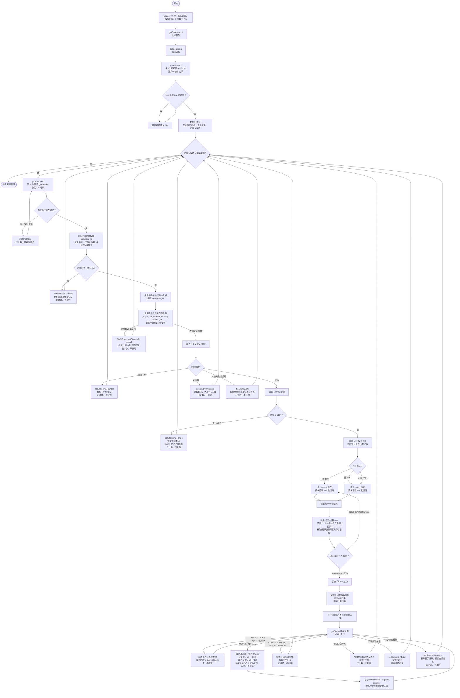

# SMSBower 号码购买与 GoPay 账号处理流程

> 本流程按 SMSBower 客户端 API 设计：服务/国家/价格查询、号码购买、验证码轮询、重复验证码请求、结算和取消。
>
> “购买数量”是供应商成功分配且已落库的号码总数上限。号码一经买到并落库即计数，后续无论重复、未注册、需要 PIN 登录、0 RP、过期、失败或删除都不退还名额、不补购；供应商尚未分配号码的临时错误可重试，且不计数。

## 附件项目复用点

- 已有号登录入口：`app/src/opai/core/gopay_protocol_worker.py` 中的 `_login_one_manual_existing`。
- 登录底层调用：`client.login`，成功后通过 `_save_account` 保存账号。
- 验证码轮询与激活状态封装：`app/src/opai/core/sms_helpers.py`。

## SMSBower 状态映射

| API 动作 | 用途 |
| --- | --- |
| `getServicesList` | 获取服务列表 |
| `getCountries` | 获取国家列表 |
| `getPricesV3` / `getPrices` | 获取价格和库存 |
| `getNumberV2` / `getNumber` | 购买号码 |
| `getStatus` | 查询验证码和激活状态 |
| `setStatus=3` | 请求下一条验证码 |
| `setStatus=6` | 完成/结算号码 |
| `setStatus=8` | 取消号码 |

参考：[SMSBower 官方 API 文档](https://smsbower.org/api/?page=client)

## 验证码展示格式

- 登录阶段：`登录验证码：XXXX`
- 设置或修改 PIN 阶段：`改 PIN 验证码：XXX`
- 后续短信：`后续验证码：1. XXXX / 2. XXXX / 3. XXX`

每条收到的验证码都追加到历史列表，按接收顺序保留，不覆盖之前的验证码。

验证码状态轮询间隔：`2 秒`。
